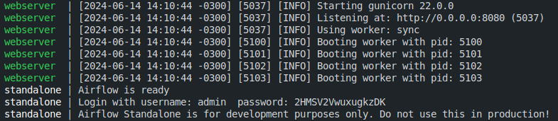
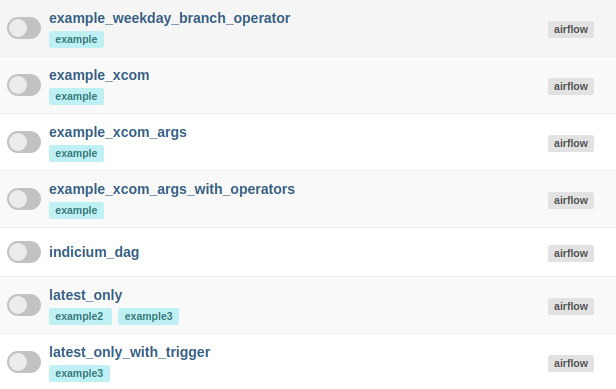
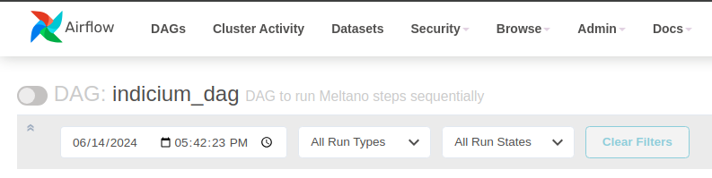
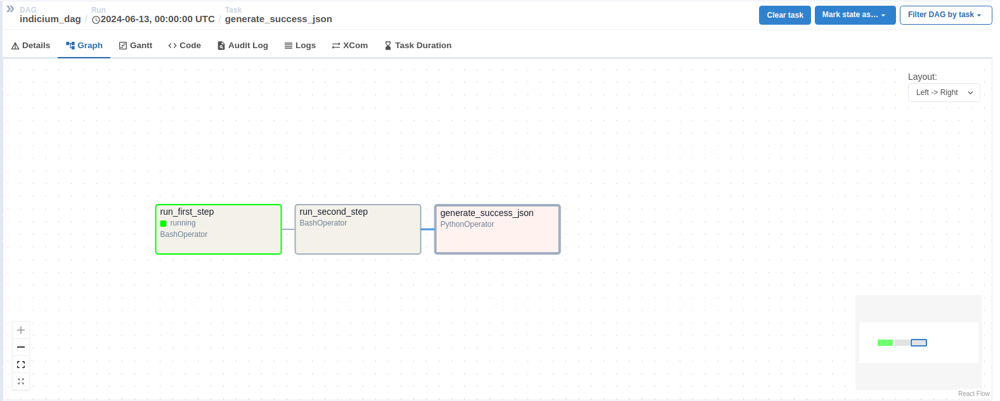

## Sequência de desenvolvimento

1. Criação de extratores (tap-postgres e tap-csv) e carregadores (target-jsonl) para a primeira etapa usando o Meltano.
2. Configuração dos mesmos, transferindo dados entre si manualmente.
3. Automação no processo de transferência de dados entre extratores e carregadores na primeira etapa, usando um script escrito em Python.
4. Transformação dos arquivos JSONL gerados na extração para CSV usando Pandas.
5. Criação de extratores (tap-csv) e carregadores (target-postgres) para a segunda etapa usando o Meltano.
6. Criação de um banco de dados PostgreSQL vazio na porta 5433 no Docker para o carregamento de dados.
7. Configuração dos mesmos, transferindo dados entre si manualmente.
8. Automação no processo de transferência de dados entre extratores e carregadores na segunda etapa, usando um script escrito em Python.
9. Separando ambientes de desenvolvimento para o Meltano e para o Apache Airflow, pois o Meltano necessita do SQLAlchemy de versões entre 2.0.30 e 3.0.0, e o Apache Airflow necessita do SQLAlchemy de versões 1.4.52 ou inferior, e assim evitando conflitos.
10. Criando Bash Scripts para execução dos scripts Python do Meltano, que está em ambiente de desenvolvimento diferente.
11. Criação da DAG separada em duas partes.
12. Execução da DAG.

## Como executar em distribuições Linux baseadas em Ubuntu

1. Entre na pasta do projeto pelo terminal.

2. Possuindo Docker e Docker Compose instalado em sua máquina, execute o comando ```docker compose up -d``` na pasta raíz do projeto para iniciar os bancos de dados PostgreSQL para extração e carregamento de dados.

3. Entre no diretório destinado ao projeto meltano utilizando o comando ```cd meltano```.
    1. Dentro desse diretório, crie um ambiente virtual digitando o comando ```python3 -m venv venv```.
    2. Ative o ambiente virtual digitando o comando ```source venv/bin/activate```.
    3. Instale as dependências deste ambiente digitando o comando ```pip install -r requirements.txt```.
    4. Entre na pasta da primeira etapa com o comando ```cd first_step``` e instale as dependências desta etapa com o comando ```meltano install```.
    5. Faça o mesmo da etapa anterior na pasta da segunda etapa.
    6. Desative o ambiente virtual com o comando ```deactivate```.

4. Volte a pasta raíz do projeto e entre na pasta destinada ao Apache Airflow com o comando ```cd airflow```.
    1. Dentro desse diretório, crie um ambiente virtual digitando o comando ```python3 -m venv venv```.
    2. Ative o ambiente virtual digitando o comando ```source venv/bin/activate```.
    3. Instale as dependências deste ambiente digitando o comando ```pip install -r requirements.txt```.
    4. Define o ambiente padrão do Apache Airflow executando o script existente na pasta digitando o comando ```source set_airflow_home.sh```.
    5. Inicie o servidor do Apache Airflow com o comando ```airflow standalone```. (Após executar esse comando, não será mais possível utilizar este terminal sem que encerre o servidor do Apache Airflow).

5. No final da execução de inicialização do servidor do Apache Airflow, será fornecido ao usuário as credenciais de login para acessar o Airflow na porta 8080, como no exemplo abaixo, que o username é <strong>admin</strong> e a senha é <strong>2HMSV2VwuxugkzDK</strong>.



6. Agora, vá até o navegador e digite a URL ```http://localhost:8080/```. A página de login do Apache Airflow será mostrada e é possível conectar usando as credenciais recebidas no passo anterior.

7. Uma lista de DAGs será mostrada, procure a DAG com nome <strong>indicium_dag</strong> e clique nela. (Pode demorar um pouco até que o servidor atualize e a DAG seja mostrada na lista).



8. Para executar a DAG, clique no  botão ao lado do título com nome da DAG.



9. Após isso, você poderá ver sua DAG sendo executada passo por passo na aba de <strong>graph</strong>.



10. Quando a DAG for totalmente executada com êxito, será possível ver um arquivo JSON na pasta ```/messages``` localizada no diretório raíz do projeto, contendo a mensagem de sucesso na execução, juntamente com a data e a hora do término da execução.

### Quando finalizado, será possível consultar o banco de dados e ver que todas as tabelas foram carregadas. Para isso, siga o passos abaixo:

1. Com os containers dos bancos de dados funcionando, digite o seguinte comando no terminal: ```docker exec -it indicium-test-db_loader-1 psql -U user -d dbloader```. Este comando lhe conectará ao banco de dados para fazer consultas.

2. Faça consultas no banco de dados no seguinte formato: <strong>SELECT * FROM tap_csv.(Nome da tabela);</strong>. Exemplo: ```SELECT * FROM tap_csv.suppliers;```
